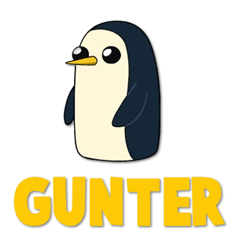

  

## What is Gunter?
Aside from being the coolest penguin in the Ice Kingdom of Ooo, it is my toy 3D
rendering engine written for fun in [Zig](https://ziglang.org/). Gunter is my pet
(project) with which I learn OpenGL graphics programming and hone my low-level skills
with a new and fun language: [Zig](https://ziglang.org/).

## What can it do?
So far, not very much. But I have big plans for Gunter:

- [x] Basic input control
- [x] Model loading (gLTF)
- [x] Phong illumination
- [x] Multiple light sources
- [x] Blending, face culling, mesh transformations
- [x] Skybox
- [ ] Environment maps
- [ ] Geometry shaders
- [ ] Instancing
- [ ] Gamma correction
- [ ] Shadows
- [ ] HDR
- [ ] Bloom
- [ ] Deferred shading
- [ ] SSAO
- [ ] PBR
- [ ] Text rendering
- [ ] Animation
- [ ] Particle system
- [ ] Basic built-in physics system
- [ ] Entity Component System
- [ ] Audio
- [ ] Build games/simulations with it
